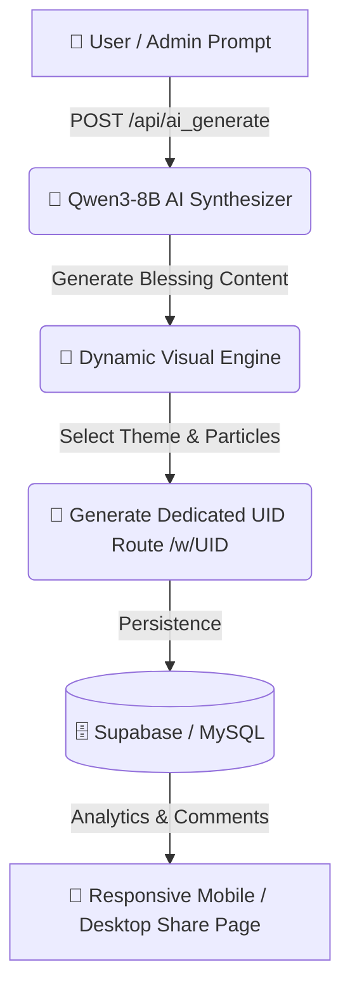

<div align="center">

```text
 ████████╗██████╗ ███╗   ██╗
 ╚══██╔══╝██╔══██╗████╗  ██║
    ██║   ██████╔╝██╔██╗ ██║
    ██║   ██╔══██╗██║╚██╗██║
    ██║   ██████╔╝██║ ╚████║
    ╚═╝   ╚═════╝ ╚═╝  ╚═══╝
```

# TBN (Wish2) — AI-Powered Personalized Wish Generation & Interactive Platform

**Theme-Rich Blessing Page Platform Built with Next.js, Qwen3-8B LLM, & Supabase/MySQL**

[ 🇺🇸 **English** ](./README.md) • [ 🇨🇳 **中文文档** ](./README_CN.md)

---

[](https://opensource.org/licenses/MIT)
[](https://nextjs.org)
[](https://react.dev)
[](https://huggingface.co/Qwen)
[](https://supabase.com)
[](https://github.com/tubban1/tbn)

</div>

---

## 💡 What is TBN (Wish2)?

**TBN (Wish2)** is a modern, theme-rich web platform for creating, editing, and sharing personalized blessing (wish) pages. Powered by **Next.js** and **Qwen3-8B LLM**, it features dynamic page routing, multi-theme visual effects, admin batch management, and AI content generation.

---

## ⚡ Key Features

<table width="100%">
<tr>
<td width="50%" valign="top">

### 🎨 1. Multi-Theme Visual Engine
* **Rich Theme Library**: Dreamy Sky, Matrix Rain, Vintage Letter, and custom particle effects.
* **Interactive FX**: Specialized CSS/Three.js visual animations per theme.

</td>
<td width="50%" valign="top">

### 🤖 2. Qwen3-8B AI Generation
* **Secure API Gateway (`/api/ai_generate`)**: Backend API key protection.
* **Batch Creation**: One-click generation of personalized blessing content for batch events.

</td>
</tr>
<tr>
<td width="50%" valign="top">

### 🔗 3. Dynamic Routing & Sharing
* **Lifecycle Routing**: Dedicated `/w/[uid]` (view) and `/e/[uid]` (edit) routes.
* **Analytics & Comments**: Real-time page view tracking and interactive comment feeds.

</td>
<td width="50%" valign="top">

### 💾 4. Dual Persistence Architecture
* **Supabase & MySQL**: Seamless data migration between local MySQL and cloud Supabase.
* **Render Worker**: Background image generation worker for exporting wish cards.

</td>
</tr>
</table>

---

## 🛠️ Architecture & Workflow



---

## 📁 Directory Structure

```
wish2/
├── pages/               # Application routes (/w/[uid], /e/[uid], /admin)
├── components/          # Theme components & visual effects
├── lib/                 # AI proxy & database connectors
├── scripts/             # Migration scripts & render worker
└── doc/                 # Product specifications & database schemas
```

---

## ⚡ Quick Start

```bash
# 1. Install dependencies
npm install

# 2. Configure environment in .env.local
# Set MYSQL_HOST, MYSQL_DATABASE, AI_API_KEY

# 3. Run development server
npm run dev
```

---

## 🤝 License

Released under the **MIT License**.
