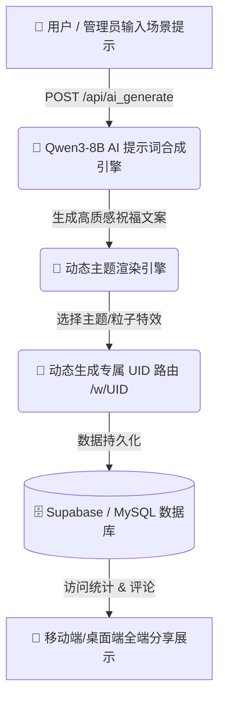

<div align="center">

```text
 ████████╗██████╗ ███╗   ██╗
 ╚══██╔══╝██╔══██╗████╗  ██║
    ██║   ██████╔╝██╔██╗ ██║
    ██║   ██╔══██╗██║╚██╗██║
    ██║   ██████╔╝██║ ╚████║
    ╚═╝   ╚═════╝ ╚═╝  ╚═══╝
```

# TBN (Wish2) — AI 赋能的智能化个性愿望生成与交互平台

**基于 Next.js + Qwen3-8B 大模型 + Supabase/MySQL 的全主题愿望卡片构建与分享平台**

[ 🇺🇸 **English** ](./README.md) • [ 🇨🇳 **中文文档** ](./README_CN.md)

---

[](https://opensource.org/licenses/MIT)
[](https://nextjs.org)
[](https://react.dev)
[](https://huggingface.co/Qwen)
[](https://supabase.com)
[](https://github.com/tubban1/tbn)

</div>

---

## 💡 什么是 TBN (Wish2)？

**TBN (Wish2)** 是一套兼具极高颜值与强交互能力的智能化愿望 (Wish) 与节日祝福卡片生成平台。用户可以通过系统在线创建、个性化定制、AI 一键合成并实时分享独一无二的愿望页面。

> 🚀 **AI 智能文案创作**：系统深度整合了 **Qwen3-8B** 大语言模型，能够根据不同的节日、受众与语境实时推演高质感祝福文案，并匹配对应的视觉主题动画与卡片风格！

---

## ⚡ 核心架构特色

<table width="100%">
<tr>
<td width="50%" valign="top">

### 🎨 1. 多主题视觉渲染引擎
* **多样化主题库**：涵盖梦幻星空、Matrix 矩阵代码流、复古手写信纸等丰富的主题特效。
* **特定 CSS/Three.js 特效**：每个主题拥有独立的视觉粒子与动效。

</td>
<td width="50%" valign="top">

### 🤖 2. Qwen3-8B AI 智能生成
* **安全代理网关 (`/api/ai_generate`)**：后端保护 API Key 密钥，支持高性能并发调用。
* **单条与批量生成**：后台支持一键批量生成数百条个性化祝福并导出。

</td>
</tr>
<tr>
<td width="50%" valign="top">

### 🔗 3. 动态路由与多端分享
* **全生命周期路由**：`/w/[uid]` (浏览查看) 与 `/e/[uid]` (个性化编辑) 分离设计。
* **分享与互动系统**：支持实时访客统计、弹幕/评论留痕与卡片分享。

</td>
<td width="50%" valign="top">

### 💾 4. 灵活的双持久化数据库
* **Supabase & MySQL 兼容**：支持本地 MySQL 高性能读写与云端 Serverless Supabase 迁移。
* **图片渲染 Worker 机制**：内置后台图片合成 Worker 导出高清晰度长图。

</td>
</tr>
</table>

---

## 🛠️ 架构与 Workflow 流程图



---

## 🛠️ 固化标准化生产工具链 (CLI Tools)

| 工具脚本 | 命令 | 功能描述 |
| :--- | :--- | :--- |
| **开发服务启动** | `npm run dev` | 启动 Next.js 本地开发服务器 |
| **生产环境编译** | `npm run build` | 构建生产环境 Web 部署包 |
| **图片渲染 Worker** | `npm run render-worker` | 启动后台长图生成与 Puppeteer 截图队列 |
| **Supabase 结构初始化** | `npm run supabase:init` | 初始化云端 Supabase 数据库表结构 |
| **数据库自动化迁移** | `npm run supabase:migrate` | 执行数据同步与 Schema 迁移 |

---

## 📁 目录结构

```
wish2/
├── pages/
│   ├── index.js         # 平台首页与愿望展示墙
│   ├── w/[uid].js       # 愿望展示独立沉浸页面
│   ├── e/[uid].js       # 愿望在线个性化编辑器
│   └── admin.js         # 管理员批量生成与数据监控看板
├── components/          # 主题渲染组件与动效组件 (Sky, Matrix, Letter)
├── lib/                 # AI API 代理、数据库 SDK 与辅助函数
├── scripts/             # Supabase 迁移脚本与后台图片合成 Worker
├── doc/                 # 产品需求文档、数据库结构与文件设计
├── styles/              # 全局样式与各主题 CSS 模块
└── package.json         # 项目依赖与配置
```

---

## ⚡ 快速开始

### 1. 配置环境变量
在项目根目录下创建 `.env.local` 配置文件：

```ini
MYSQL_HOST=localhost
MYSQL_DATABASE=wish2
MYSQL_USER=root
MYSQL_PASSWORD=your_password
AI_API_KEY=your_qwen_api_key
```

### 2. 安装依赖并启动

```bash
# 安装依赖
npm install

# 启动开发服务器
npm run dev
```

系统访问：
* 前台：`http://localhost:3000/`
* 后台管理：`http://localhost:3000/admin` (默认口令: `biel2025`)

---

## 🤝 开源协议 (License)

本项目基于 **MIT License** 开源。

<div align="center">
  <sub>TBN 工程团队精心打造。基于 Next.js, React, Qwen3-8B 与 Supabase 构建。</sub>
</div>
