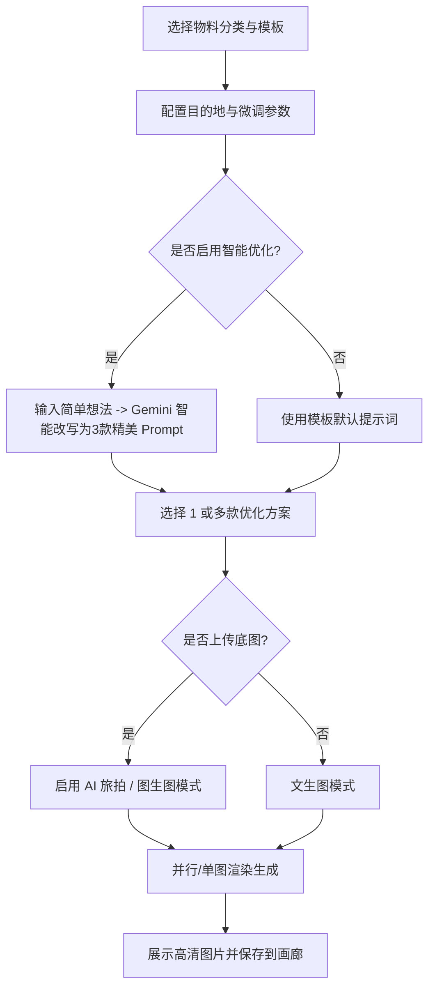
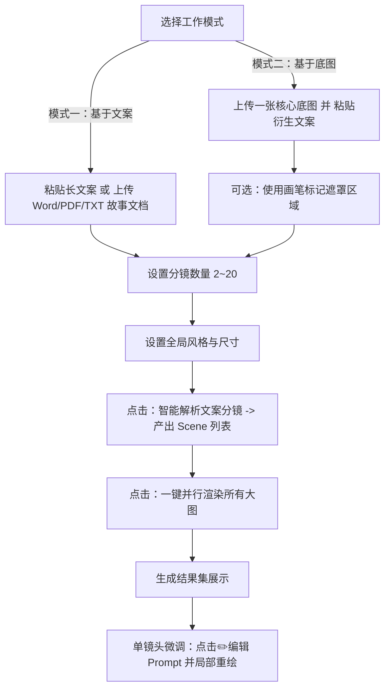

# 天工创界（TImage & MultiImage）AI 智能生图系统操作手册

> [!NOTE]
> **天工创界**是专为旅游行业客户定制的一站式 AI 智能视觉营销与内容生成系统。通过高度优化的 AI 生图算法，为旅行社、OTA 平台、民宿酒店及定制路书设计师提供极具感官诱惑和专业商业质感的图像资产。

---

## 目录
- [1. 系统概述与模块分工](#1-系统概述与模块分工)
- [2. 账号体系与额度机制](#2-账号体系与额度机制)
- [3. TImage：单图智能定制生图指南](#3-timage单图智能定制生图指南)
- [4. MultiImage：多幕叙事故事画板指南](#4-multiimage多幕叙事故事画板指南)
- [5. 进阶实操技巧与高级 Prompt 渲染](#5-进阶实操技巧与高级-prompt-渲染)
- [6. 常见故障与排查指南](#6-常见故障与排查指南)

---

## 1. 系统概述与模块分工

天工创界系统主要由两大核心生图工具组成，分别满足不同的业务场景：

| 模块名称 | 核心定位 | 适用场景 | 关键技术亮点 |
| :--- | :--- | :--- | :--- |
| **TImage** （旅游智绘 Agent） | **单图/批量单图精细化定制** | 营销海报、行程单长图配图、社交媒体种草图、酒店/民宿氛围概念图、游客人像 AI 旅拍。 | - 提供三大核心旅游模板 - 目的地场景四维微调参数 - Gemini 提示词智能优化（一键出3款） - 支持底图人像无缝融合 |
| **MultiImage** （多幕叙事画板） | **连续故事线与分镜批量生成** | 微信公众号推文连续配图、长文案故事板、旅游宣传片画板、同一底图的局部多图衍生。 | - AI 深度阅读长文案/文档 - 自动分析并提取 2~20 幕分镜 - 强制全局风格与输出尺寸一致性 - 单镜头编辑与一键并行渲染 |

---

## 2. 账号体系与额度机制

系统内置了简化的智能邮箱登录与额度防损机制，确保您的每一次操作和资产都得到安全保护。

### 2.1 快捷登录与新用户福利
* **免去复杂注册**：首次在系统右上角输入您的电子邮箱与密码并点击验证，系统会自动为您创建账号。
* **新手赠送**：新注册邮箱会自动获得初始赠送的 **30 个免费额度**，可直接用于体验生图服务。
* **老用户登录**：输入已注册邮箱和密码即可登录并同步历史生成的作品。

### 2.2 额度消耗明细
系统的生图和智能分析根据计算负载，严格按照以下规则扣除额度：

* **智能提示词优化 (TImage)**：每次消耗 **1 额度**。
* **智能分镜提取 (MultiImage)**：每次消耗 **1 额度**。
* **标准规格生图 (≤ 1.5M 像素，如 1024x1024 / 1024x1365)**：每次生成消耗 **5 额度**。
* **超高规格大图 (≥ 3M 像素，如 1024x1792 竖版大图或更大)**：每次生成消耗 **25 额度**。

> [!TIP]
> **自动退额机制**：如果在智能提示词优化、分镜提取或生图过程中发生网络请求错误或后台异常，系统会自动执行**原子退额**，将已预扣除的积分即时退回到您的账户中，防止积分受损。

---

## 3. TImage：单图智能定制生图指南

TImage 致力于解决旅游营销中“找不到好看的目的地配图”和“缺少海报物料”的痛点。

### 3.1 三大核心物料分类
进入 `timage` 页面，左侧预设了旅游行业最常用的三大物料类别。点击即可自动加载推荐的画幅比例与特调提示词：
1. **一、营销获客类图片**：
   * **旅游攻略图/行程长图**（推荐 1024x1792, 9:16）：适合小红书和微信朋友圈分享。
   * **爆款旅游海报**（推荐 1024x1365, 3:4）：画面上部留白，便于后期添加定制广告词。
   * **社交媒体种草图文**（推荐 1024x1024, 1:1）：色彩鲜艳，吸引眼球。
2. **二、产品设计类图片**：
   * **目的地视觉概念图**（推荐 1792x1024, 16:9）：仙境般、宽画幅的史诗风光。
   * **季节/时间转换图**（推荐 1024x768, 4:3）：展现同一目的地在不同季节与光线下的对比。
   * **酒店/民宿氛围图**（推荐 1792x1024, 16:9）：落地窗、奢华光影搭配窗外美景。
3. **三、客户服务类图片**：
   * **游客AI旅拍/出片**（推荐 1024x1365, 3:4）：将底图人像自然融入目的地场景。
   * **行程方案配图**（推荐 1024x768, 4:3）：扁平或唯美水彩手绘风的地标插画。

### 3.2 目的地与场景参数微调
通过页面中部的参数面板，您可以实时修改以下参数，AI 会将它们无缝拼装进预设模板中：
* **目的地与核心地标**：例如“九寨沟五彩池”、“京都清水寺”。
* **行程亮点（攻略类特有）**：输入您需要展示的核心景点，如“碧绿海子、五彩池、珍珠滩瀑布”。
* **艺术风格与视效**：提供电影胶片、风光纪录片真实质感、日系治愈动漫、手绘水彩、赛博朋克等多种选择。
* **季节与光效**：支持日落黄金时刻、暖春清晨、银冬雪夜、盛夏星空等，让同一场景展现截要不同的意境。

### 3.3 Gemini 智能提示词优化
当您有模糊的想法或希望成图效果更上一个台阶时，可使用**智能提示词优化**功能：
1. 在输入框中输入您的简单构想，例如：“*情侣在海滩看日落，十分浪漫*”。
2. 点击 **“智能优化”**，Gemini 引擎会结合当前选中的物料类别，为您改写并润色出 **3 款不同风格的英文大片级生图指令**，并在前台以中文和英文双语展示卡片。
3. 提示词加入了极具地方文化底蕴的文字排版标签（如川渝的 `reads "巴适得板"`，西藏的 `reads "扎西德勒"` 等，见第5节），增加海报的文化冲击力。

### 3.4 批量与多通道生成
* 在智能优化生成的 3 款方案中，您可以**勾选多条**。
* 确认后点击生成，系统将启用**批量生图模式**，以多通道并行渲染，每隔 2 秒自动触发请求（防频率限制）。
* 生成完毕后，多张高清大图会同步显示在“当前会话产出”区域。

### 3.5 游客AI旅拍与图生图 (Image-to-Image)
如果您需要将游客的照片融合进风光中，或者根据既有图片做参考：
1. 点击或拖拽图片到**“上传参考底图/旅拍图”**区域（支持最多上传 6 张参考图片）。
2. 在微调参数中指定目标场景和提示词。
3. 点击生成，AI 绘画引擎会自动提取上传图片中的主体人物/构图，无缝重绘融合进目的地风景中。

### 3.6 拖拽上传与文本追加快捷操作
* **文件拖拽/剪贴板粘贴**：您可以直接拖入或粘贴多个图片文件到输入区。
* **.txt 导入**：支持将文本文件（.txt）拖入提示词区域，内容会自动读取并追加到当前的文本框末尾，免去复制粘贴的繁琐操作。

---

## 4. MultiImage：多幕叙事故事画板指南

MultiImage 专为长篇文案或连续故事情节而设计，解决“多张配图风格各异、主角不连贯、画风不统一”的顽疾。

### 4.1 核心模式介绍
在 MultiImage 顶部，提供两种生成逻辑：
1. **基于文案：纯分镜大片**：
   * 适合将小说、推文、旅游行程攻略等文字直接转化成连贯的画册。
   * 系统通过强制所有分镜使用统一的 `unifiedStyle` 和 `unifiedSize`，确保系列图片整体调性完全一致。
2. **基于底图：单图局部衍生**：
   * 适合围绕一个固定场景或角色进行多图故事展开。
   * 用户上传一张“核心底图”，AI 将以该底图为底版，配合解析出的各幕分镜提示词，做局部的修改和衍生重绘。

### 4.2 智能文案分镜提取
* **文档直接导入**：除直接粘贴长文本外，您可以点击**“上传 PDF/DOCX 直接分析”**按钮，上传您的企划案或文稿（支持 PDF 与 DOCX，大小需在 10MB 以内）。后台会调用 `mammoth` 提取 DOCX 中的格式化文字，或用大模型理解 PDF 内容。
* **分镜数量设定**：在输入框下方可设定希望提取的分镜数（支持 **2 ~ 20 幕**）。
* **提取动作**：点击 **“第一步：智能解析文案分镜”**，AI 会深度通读全文，将故事拆解成指定数量的画面，并自动为每一幕生成详细的构图、元素描述和专业绘图 Prompt。

### 4.3 风格与尺寸设置
在生成前，您必须在参数区设定好全局的一致性风格和比例：
* **统一风格选项**：电影感摄影、宫崎骏动画风格、皮克斯 3D 渲染、唯美浪漫水彩、赛博朋克风、极简扁平化、美式漫画风格等。
* **输出尺寸比例**：支持 9:16 行程长图、1:3 瀑布流长图、3:4 小红书图文、16:9 风光大片、1:1 正方形配图、4:3 行程细节图。

### 4.4 基于底图的画笔标记 (Image Markup)
在“基于底图”模式下，当您上传完底图后：
1. 鼠标悬停在预览图上，点击预览图即可打开 **画笔标记弹窗**。
2. 您可以使用画笔直接在图片上涂抹，标记出希望 AI 重点重绘或保持的“遮罩/标记区域”。
3. 涂抹完毕后保存，结合分镜提示词生图时，AI 将能够进行更精准的局部修改（局部重绘）。

### 4.5 分镜二次微调与单图重新生成
批量并行生成所有分镜图后，如果某一张图的效果不够理想：
1. 鼠标悬停在该张生图的卡片上，点击右上角的 **编辑铅笔图标 (✏️)**。
2. 在弹出的微调窗口中，直接手动修改当前镜头的中文/英文提示词。
3. 点击 **“保存并重新生成”**，系统会单独对该分镜发起重新绘制，而不会影响和重新扣除其他已生成分镜的积分。

---

## 5. 进阶实操技巧与高级 Prompt 渲染

为了能更好地控制图像中的排版、文字，乃至将文化元素融入海报中，您可以利用本系统特有的 Prompt 设计机制：

### 5.1 英文排版与文化彩蛋标签 (`reads "..."`)
由于系统接入的图像引擎对文字渲染具备极强的理解能力，在撰写或优化提示词时，您可以巧妙运用 `reads "文字"` 的标签来直接在海报中画出指定文案。
在提示词优化中，我们内置了极具地域特色的人文词库，您也可以手动在提示词中追加：

* **藏区/西藏旅游海报**：
  * Prompt 示例：`An elegant travel poster of Lhasa, with a reads "བཀྲ་ཤིས་བདེ་ལེགས།" printed in clean gold serif font at the bottom...`（将精美的藏文“吉祥如意/扎西德勒”优雅地渲染在海报下方）。
* **川渝市井风情海报**：
  * Prompt 示例：`A cozy Chengdu hot pot alley restaurant scene, neon signs reads "巴适得板" in bold red artistic calligraphy...`（渲染充满街头霓虹感和火辣气息的“巴适得板”四川方言招牌）。
* **云南风光海报**：
  * Prompt 示例：`A cinematic sunset over Erhai lake, minimal poster layout with reads "风花雪月" in high-end Chinese typography...`（渲染富含意境的“风花雪月”四个大字）。
* **泰国/东南亚海报**：
  * Prompt 示例：`A warm beach resort poster, reads "Sawasdee Thailand" in tropical golden typeface...`。
* **欧洲古典高奢海报**：
  * Prompt 示例：`A romantic retro Rome street photography, elegant magazine editorial design, reads "LA DOLCE VITA" in clean layout...`。

### 5.2 画面排版指令
如果目标是做宣传折页或长海报，请务必在 Prompt 中加入以下视觉排布指令，成图将自动展现专业海报质感：
* `elegant poster layout`（优雅的海报版式）
* `travel editorial design`（旅游社论版式）
* `bold stylish graphic layout`（前卫的图形排版版式）
* `top copy space`（顶部留白空间，便于后期添加字词）

---

## 6. 常见故障与排查指南

| 现象 | 可能原因 | 解决办法 |
| :--- | :--- | :--- |
| **登录提示“密码错误，请重试！”** | 输入了该邮箱首次登录时创建以外的密码。 | 请输入您最初创建账号时使用的密码；或更换一个全新的邮箱地址登录（系统会自动视为新用户并赠送额度）。 |
| **提示“额度不足，需要 X 额度，当前仅剩 Y”** | 生成超大尺寸图（25分）或批量生图时额度耗尽。 | 1. 尝试在全局设置中将尺寸调为标准大小（如 1024x1024 / 1024x1365，单张仅需 5 额度）。 2. 联系系统管理员或点击右上角“充值请联系”扫码增加积分额度。 |
| **导入 PDF 或 DOCX 报错失败** | 1. 文件大于 10MB 限制。 2. 文档受到强加密或损坏。 | 1. 请使用 PDF 压缩工具将文件压缩至 10MB 以下。 2. 直接在原始文档中全选复制文本，在页面的文案大文本框中直接粘贴进行解析。 |
| **生成的图片在画廊中显示“Image Saved Locally”的占位图** | 由于网络或云服务限制，图片没有成功同步保存到永久外链托管宿主服务中。 | 数据库已安全存储该图像的本地 Base64 编码。您可以直接点击“下载”或“预览”大图，或者在历史画廊中将该图片导出到本地保存，这不影响您的最终使用。 |
